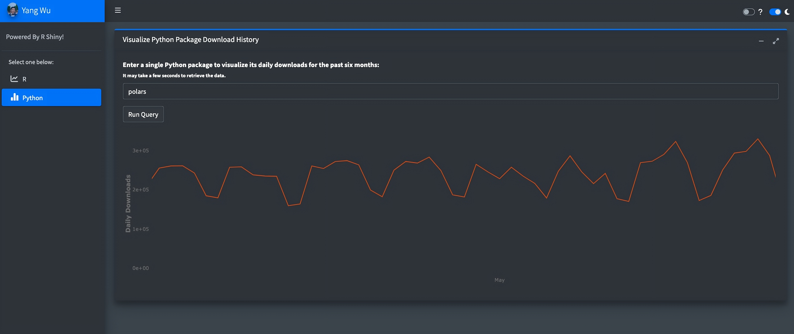
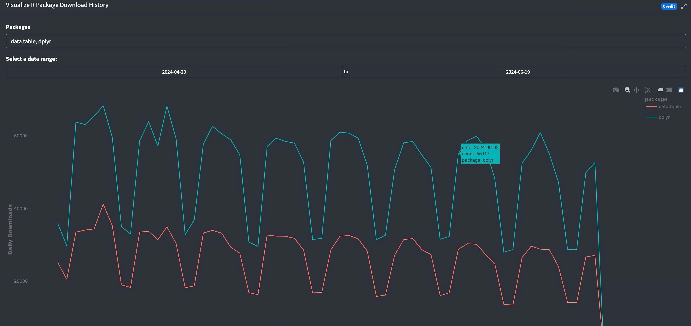

<!-- README.md is generated from README.Rmd. Please edit that file -->

# TrackerDashboard

<!-- badges: start -->
<!-- badges: end -->

Credit belongs to [Hadley
Wickham](https://github.com/hadley/cran-downloads), the creator of the
original CRAN package download shiny application. This is my own version
of his project using the `bs4Dash` package and including Python data.

## Google BigQuery

The download logs from PyPI in the dashboard requires the use of
BigQuery, which is accomplished in R through the use of the `bigrquery`
package. BigQuery has a free tier, which offers 10 GB storage and up to
1 TB queries per month. For working with Google APIs, refer to the
`gargle` package, which `bigrquery` uses to deal with authentication,
and its
[vignettes](https://gargle.r-lib.org/articles/get-api-credentials.html).

### BigQuery Setup

In order to use BigQuery:

1.  Set up a Google Cloud account [here](https://cloud.google.com/) and
    create a new project.

2.  Enable API for Google Cloud platform (GCP) as specified in the
    `gargle`
    [documentation](https://gargle.r-lib.org/articles/get-api-credentials.html#enable-apis)
    under the section **Enable API(s)**.

3.  Set up billing for Google Cloud account (see
    [documentation](https://cloud.google.com/billing/docs/how-to/manage-billing-account)).
    No payment is required if usage stays under free tier.

4.  [Create service
    account](https://cloud.google.com/iam/docs/creating-managing-service-accounts)
    and [create
    key](https://cloud.google.com/iam/docs/creating-managing-service-account-keys)
    (.json file).

5.  Set environment variable:

``` r
# Name of the project created
Sys.setenv(BIGQUERY_TEST_PROJECT = "project_name")
# Service account key
Sys.setenv(path_to_bq_token = "path_to_key_json.json")
# For non-interactive use 
bq_auth(path = Sys.getenv("path_to_bq_token"))
```

6.  For non-interactive use, see the `gargle`
    [documentation](https://gargle.r-lib.org/articles/non-interactive-auth.html).

## Installation

Install TrackerDashboard from [GitHub](https://github.com/) with:

``` r
# install.packages("devtools")
devtools::install_github("YangWu1227/tracker-dashboard")
```

## Application

To run app.R:

``` r
library(TrackerDashboard)

# Service account token ---------------------------------------------------

bq_auth(path = Sys.getenv("path_to_bq_token"))

# Pool object -------------------------------------------------------------

pool <- dbPool(
  drv = bigquery(),
  project = "bigquery-public-data",
  dataset = "pypi",
  billing = bq_test_project()
)
onStop(function() {
  poolClose(pool)
})

# Variables for default R text inputs -------------------------------------

top5 <- cran_top_downloads(count = 5)$package
today <- Sys.Date() - 1
last_month <- today - 60

runApp(top5, today, last_month, pool)
```

## Dashboard Interface

### Polars (Python)



### Data.Table & Dplyr (R)


